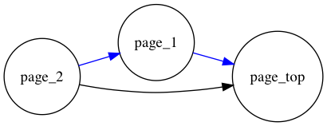
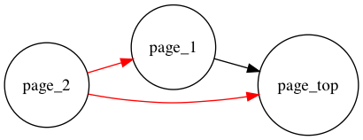

# TL;DR

-   `Vue-Router` の`BeforeRouteLeave`等ナビゲーションガードが二回発火する場合がある。
-   遷移先のコンポーネントに何らかのリダイレクトがあるときに発生する。
-   `to`や`from`を調べることで回避可能。

同じ問題を扱ったissue
=> <https://github.com/vuejs/vue-router/issues/2102>

-   本件は仕様として扱われるようなので、今後しばらく対応される見込みはなさそう。

# 再現環境

-   Chrome バージョン: 75.0.3770.142
-   Nuxt 2.6
-   vue-router 3.0

# リポジトリと検証動画

<https://github.com/IKKO-Ohta/invoke_brl_twice>


トップページ - ページ１ - ページ2という構成で、

-   ページ２のバックボタンを押すと、`window.confirm()`を表示する。「OK」を押すとページ１に遷移する。
-   ページ１では、ページ2からの遷移をキャッチするとトップページに飛ばす

想定としては、例えば商品販売サイトにおいて、ページ２が注文完了画面で、ページ１が決済確認ページ、くらいのとき。
しかしこのとき、ページ２の`BeforeRouteLeave` が2度発火する。`window.confirm()`のOKを1度押しても再度ダイアログが表示される。

# どうして起こるか？

## 予想



2 =>  1, 1 => top のような遷移をしそうな気がする。

## 実際



実際のページ２の`beforeRouteLeave`はこのように挙動する。

`beforeRouteLeave`が 2=>1 と 2 => top の2回分呼ばれる。引数の`from.name`と`to.name`の中身を調べると確かにそうなっている。1=>top へのリダイレクトがこの2回目の遷移を誘発させる。**このとき1=>topの遷移でもない！ あくまで from="2", to="top"の`beforeRouteLeave`が走る！**

# 解決策

`ページ2`の`beforeRouteLeave`の`to`を検査し、一回目の遷移についてガードしないようにすれば良い。

## before

```js
  beforeRouteLeave(to, from, next) {
    window.confirm("このページを離れますか？") ? next() : next(false);
  }
```

## after

```js
  beforeRouteLeave(to, from, next) {
    if (to.name === "first") {
      next();
      return;
    }

    window.confirm("このページを離れますか？") ? next() : next(false);
  }
```

なお、afterは可読性の低いコードなので（一見「戻る」のときにはガードしない、というコードに見える）公式issueなどを引用して適宜コメントに追記することを推奨する。
